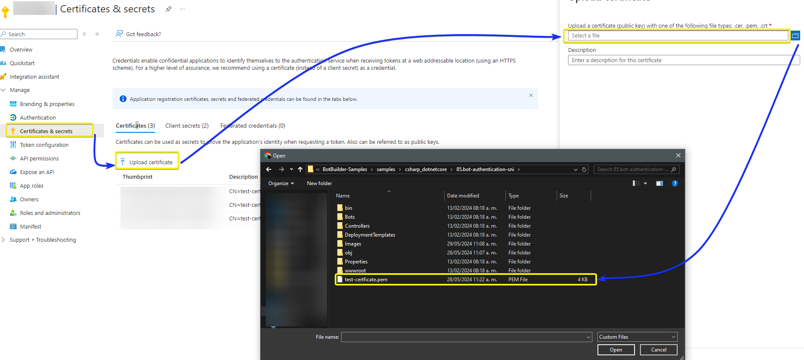
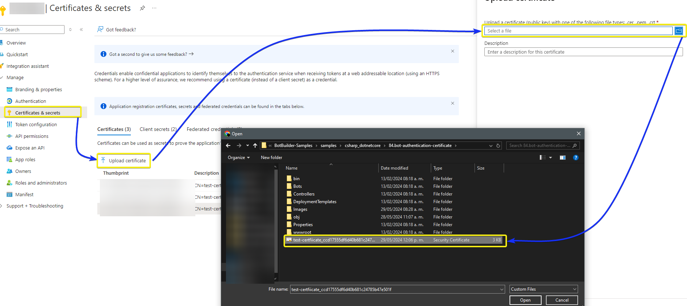

[#LocalEnv]:#using-local-environment
[#KeyVaultEnv]:#using-keyvault
[#TrySample]:#to-try-this-sample

# Authentication Bot using Subject Name/Issuer

Bot Framework v4 bot authentication using Subject Name/Issuer

This bot has been created using Bot Framework, it shows how to use the bot authentication capabilities of Azure Bot Service. In this sample, we use a local or KeyVault certificate and the MSAL Subject Name/Issuer configuration to create the Bot Framework Authentication.
> [!IMPORTANT]
> Microsoft's first-party resources are required to test this sample.

In this guide, we'll explain how to consume a certificate in Bot Framework with the following options:
1. [Local environment][#LocalEnv]
2. [KeyVault][#KeyVaultEnv]

## Interacting with the bot

This sample uses the bot authentication capabilities of Azure Bot Service, providing features to make it easier to develop a bot that authenticates users using digital security certificates. You just need to provide the certificate data linked to the managed identity and run the bot, then communicate with it to validate its correct authentication.

## SSL/TLS certificate

An SSL/TLS certificate is a digital object that allows systems to verify identity and subsequently establish an encrypted network connection with another system using the Secure Sockets Layer/Transport Layer Security (SSL/TLS) protocol. Certificates are issued using a cryptographic system known as public key infrastructure (PKI). PKI allows one party to establish the identity of another through the use of certificates if they both trust a third party, known as a certificate authority. SSL/TLS certificates therefore function as digital identity documents that protect network communications and establish the identity of websites on the Internet as well as resources on private networks.

## Subject Name and Issuer (SNI) Authentication

Certificate Subject Name and Issuer (SNI) based authentication is currently available only for Microsoft internal (first-party) applications. External (third-party) apps cannot use SNI because SNI is based on the assumption that the certificate issuer is the same as the tenant owner. This can be guaranteed for some first-party tenants, but not for third-party. So there are no plans to bring SNI to third-party apps. For more details about this feature and code examples see this [SNI issue](https://github.com/AzureAD/microsoft-authentication-library-for-python/issues/60) and a [wiki page](https://aadwiki.windows-int.net/index.php?title=Subject_Name_and_Issuer_Authentication).

## Prerequisites

- [Ngrok](https://ngrok.com/) latest version.
- [.NET SDK](https://dotnet.microsoft.com/download) version 8.0

  ```bash
  # determine dotnet version
  dotnet --version
  ```

## To try this sample

- Setup ngrok
    1. Follow this [guide](https://ngrok.com/docs/getting-started/?os=windows) to install and configure ngrok in your environment.
    2. Run ngrok with the following command.
       ```bash
       ngrok http --host-header=rewrite 3978
       ```
       
- Setup a Bot
>  [!NOTE]
>  The app registration used here can be Single or Multi tenant.

1. Register a bot with Azure Bot Service, following the instructions [here](https://docs.microsoft.com/azure/bot-service/bot-service-quickstart-registration?view=azure-bot-service-3.0).
2. After registering the bot, use `<NGROK_FORWARDING_DOMAIN>/api/messages` as the messaging endpoint.
    > NOTE: make sure to take note of the Microsoft App Id as we'll need this for later.
- Clone the repository
    ```bash
    git clone https://github.com/microsoft/botbuilder-samples.git
    ```

- Setup the app registration 
      Go to the app registration used by the azure bot and add the following configuration to the manifest: 
      
      "trustedCertificateSubjects": [
          {
              "authorityId": "00000000-0000-0000-0000-000000000001",

              "subjectName": "certificate_subject_name",

              "revokedCertificateIdentifiers": []
          }
      ]

- Configure the SSL/TSL certificate. This sample requires an existing certificate issued by an integrated CA. We have two options to configure it in the bot. Below is a step-by-step description of each one:

  ### Using local environment
  1. Configure the following app settings variables:
     - MicrosoftAppId: App Id of your bot (gathered from the [Setup a Bot][#TrySample] step).
     - MicrosoftAppType: Type of the App (optional for MultiTenant apps).
     - MicrosoftAppTenantId: Tenant Id to which your bot belongs (optional for MultiTenant apps).

  2. Intall and configure [OpenSSL](https://www.openssl.org/source/) with the latest version
    - Download the latest version source and add the folder to the [environment variables](https://www.java.com/en/download/help/path.html) path.
      ```bash
      setx path "%path%;<OpenSSL path here> 
      e.g
      setx path "%path%;C:\Program Files\openssl-3.3.0"
      ```

  3. Generate a _pem_ file without key:
      - If your certificate is in _pfx_ format execute the following command:
      ```powershell
      OpenSSL pkcs12 -in .\<certificate-name>.pfx -out <certificate-name>.pem –nodes -nokeys
      ```
      e.g:
        

      - If your certificate is in _pem_ format and includes the key, execute the following command to remove the key:
      ```powershell
      OpenSSL pkcs12 -in .\<certificate-name>.pem -export -out .\<certificate-without-key-name>.pem -nokeys
      ```
      e.g:
        

  4. Upload the generated certificate to the Azure app registration.

      

  5. To read the certificate in the bot, the _pem_ file must include the key, then if your certificate is in _pfx_ format go to the certificate location and run the following command to generate a _pem_ file with key:

      ```powershell
      OpenSSL pkcs12 -in .\<certificate-name>.pfx -out <certificate-with-key-name>.pem –nodes
      ```
      e.g
        

  6. In the sample code, go to the [Startup](Startup.cs) class and uncomment the line of code that reads the local certificate and write the name of the certificate in _pem_ format inside the _CreateFromPemFile_ method. 
  Be sure to comment out or remove the lines of code that use Azure KeyVault to avoid errors.
  Keep in mind that the SNI authentication works with the sendX5C flag, keep its value in _true_.
  
      > NOTE: Here the values of `MicrosoftAppId` and `MicrosoftTenantId` are needed to generate the credentials.

      

  ### Using KeyVault
  1. This option requires the following app settings variables:
     - KeyVaultName: Name of the KeyVault containing the certificate.
     - CertificateName: Name of the certificate in the KeyVault.
     - MicrosoftAppId: App Id of your bot (gathered from the [Setup a Bot][#TrySample] step).
     - MicrosoftAppType: Type of the App (optional for MultiTenant apps).
     - MicrosoftAppTenantId: Tenant Id to which your bot belongs (optional for MultiTenant apps).

  2. Import the certificate under the Certificates section, hit on Generate/Import, complete the form, and upload the certificate.

      
      

  3. Go to the details of the certificate and download it in _CER_ format to avoid the export of the private key.

      
      

      >NOTE: If you downloaded it in _PFX/PEM_ format, it will be neccesary to remove the private key by executing one the following commands:
      ```powershell
      OpenSSL pkcs12 -in .\<certificate-name>.pfx -out <certificate-name>.pem –nodes -nokeys
      OpenSSL pkcs12 -in .\<certificate-name>.pem -export -out .\<certificate-without-key-name>.pem -nokeys
      ```
      e.g:
        
        

  4. Upload the certificate to the Azure app registration.

      

  5. In the sample code, go to the [Startup](Startup.cs) class and uncomment the line of code that reads the keyvault certificate and verify that the keyvault credentials are completed in the [appsettings](appsettings.json) file.
  Be sure to comment out or remove the lines of code that use local certificate to avoid errors.
  Keep in mind that the SNI authentication works with the sendX5C flag, keep its value in _true_.
      > NOTE: Here the values of `MicrosoftAppId` and `MicrosoftTenantId` are also needed to generate the credentials.

      

  6. In the current sample context, log into Azure to obtain the default credentials by executing the following command.
      ```powershell
      az login
      ```

### Run the bot from a terminal or from Visual Studio:

  - From a terminal, navigate to `samples/csharp_dotnetcore/85.bot-authentication-sn`

  ```bash
  # run the bot
  dotnet run
  ```

  - Or from Visual Studio

  - Launch Visual Studio
  - File -> Open -> Project/Solution
  - Navigate to `samples/csharp_dotnetcore/85.bot-authentication-sn` folder
  - Select `AuthSNIBot.csproj` file
  - Press `F5` to run the project

## Testing the bot using Azure Bot

Go to the Azure bot resource created previously, select the _Test in Web Chat_ option under the _Settings_ section and start talking to the bot.


## Deploy the bot to Azure

To learn more about deploying a bot to Azure, see [Deploy your bot to Azure](https://aka.ms/azuredeployment) for a complete list of deployment instructions.

## Further reading

- [Bot Framework Documentation](https://docs.botframework.com)
- [Bot Basics](https://docs.microsoft.com/azure/bot-service/bot-builder-basics?view=azure-bot-service-4.0)
- [Azure Portal](https://portal.azure.com)
- [Activity processing](https://docs.microsoft.com/en-us/azure/bot-service/bot-builder-concept-activity-processing?view=azure-bot-service-4.0)
- [Azure Bot Service Introduction](https://docs.microsoft.com/azure/bot-service/bot-service-overview-introduction?view=azure-bot-service-4.0)
- [Azure Bot Service Documentation](https://docs.microsoft.com/azure/bot-service/?view=azure-bot-service-4.0)
- [.NET Core CLI tools](https://docs.microsoft.com/en-us/dotnet/core/tools/?tabs=netcore2x)
- [Azure CLI](https://docs.microsoft.com/cli/azure/?view=azure-cli-latest)
- [Azure Portal](https://portal.azure.com)
- [Channels and Bot Connector Service](https://docs.microsoft.com/en-us/azure/bot-service/bot-concepts?view=azure-bot-service-4.0)
- [SSL/TLS certificates](https://www.digicert.com/tls-ssl/tls-ssl-certificates)
- [Subject Name and Issuer (SNI) Authentication](https://github.com/AzureAD/microsoft-authentication-library-for-dotnet/wiki/Subject-Name-and-Issuer-(SNI)-Authentication)
